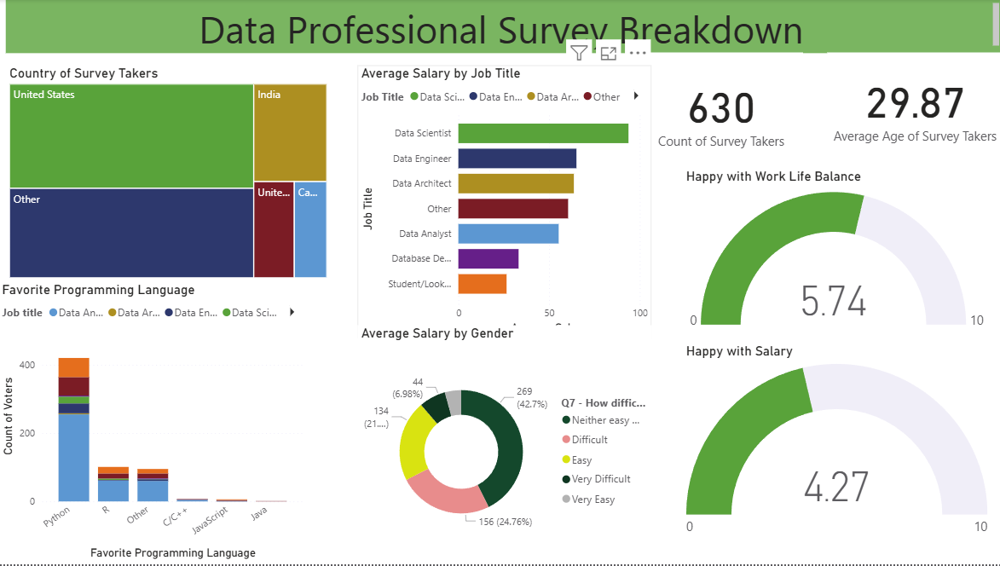

# PowerBI-DataProfessionalSurveyBreakdown
---

### Overview
This is Visualization project based on data professionals survey dataset available for data modelling, visualization and dashboarding. 
To conduct a comprehensive analysis using the survey dataset we have to identify some valueable key insights for our Visualisation in PowerBI.

---

### Data Sources
The primary dataset used for this analysis is the "data-professionals-survey.xlsx" 
file containing detailed information of survey taken from the employers of the company for our analysis process.

---

### Tools 
- PowerQuery(PowerBI)- Data Cleaning
- PowerBI - Dashboard Visualization

---

### Key Insights and Parameters for Analysis

- Country of Survey Takers
- Average Salary by Job Title
- Average Salary by Gender
- Count of Survey Takers
- Average Age of Survey Takers
- Happy with Work Life Balance
- Happy with Salary
- Favorite Programming Language
